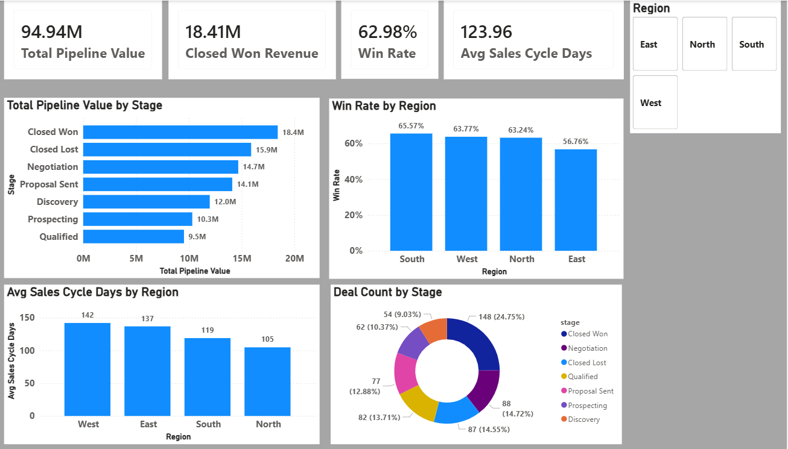

# 📊 Sales Pipeline Analytics & Revenue Optimization

> End-to-end B2B CRM analytics project — from raw messy data to actionable business insights and an interactive Power BI dashboard.

---

## 🧩 Problem Statement

B2B sales teams often struggle to identify **where pipeline value is leaking** — which deals stall, which regions underperform, and why high-value opportunities are lost more frequently than smaller ones.

This project simulates a real-world CRM dataset and builds a complete analytics solution to answer those questions.

---

## 🎯 Project Objectives

- Clean and standardize messy real-world CRM data
- Calculate key sales metrics: Pipeline Value, Win Rate, Sales Velocity
- Identify revenue leaks and regional performance gaps
- Build an interactive Power BI dashboard for business stakeholders

---

## 🔍 Key Business Insights

| # | Insight | Impact |
|---|---------|--------|
| 1 | High-value deals (avg ₹2.22L) stall at Discovery stage — only 9% of pipeline | ₹12M stuck early |
| 2 | Team wins smaller deals (avg ₹1.24L) but loses larger ones (avg ₹1.83L) | Top-line growth limited |
| 3 | East region: 56.8% win rate and 137-day avg sales cycle | Weakest region across all KPIs |

---

## 📊 Dashboard Preview



---

## 🛠️ Tools & Technologies

| Tool | Purpose |
|------|---------|
| Python (pandas, numpy, faker) | Data generation and cleaning |
| Power BI | Dashboard and DAX measures |
| GitHub | Version control and portfolio |

---

## 🧹 Data Cleaning Steps

1. **Removed duplicates** — 45 duplicate deal_id rows dropped
2. **Standardized stage names** — 23 dirty variants mapped to 7 clean standard stages
3. **Fixed region and lead source** — inconsistent casing standardized
4. **Corrected deal values** — negatives converted, nulls imputed using industry + lead source mean
5. **Parsed mixed date formats** — 5 different formats unified using robust dateutil parser

---

## 📈 Metrics Calculated

### Pipeline Value
- Total Pipeline: ₹94.9M
- Active Pipeline: ₹60.6M
- Closed Won Revenue: ₹18.4M
- Closed Lost Value: ₹15.9M

### Win / Loss Analysis
- Overall Win Rate: 63.0%
- Avg Won Deal Value: ₹1.24L
- Avg Lost Deal Value: ₹1.83L

### Sales Velocity
- Avg Sales Cycle: 124 days
- Sales Velocity: ₹93,553/day
- Monthly Revenue Run Rate: ₹28.1L
- Annual Revenue Run Rate: ₹3.41Cr

### Regional Performance

| Region | Win Rate | Avg Cycle | Velocity/Day |
|--------|----------|-----------|--------------|
| North  | 63.2%    | 105 days  | ₹33,956      |
| South  | 65.6%    | 119 days  | ₹26,722      |
| West   | 63.8%    | 142 days  | ₹25,894      |
| East   | 56.8%    | 137 days  | ₹9,011       |

---

## 💡 Business Recommendations

1. **Discovery stage intervention** — assign senior reps to high-value Discovery deals above ₹2L to improve progression rate
2. **Large deal coaching** — analyze lost deals above ₹1.5L for common objection patterns and build targeted playbook
3. **East region audit** — review East team qualification process and implement weekly pipeline review to reduce 137-day cycle

---

## 🚀 How to Run
```bash
# Clone the repository
git clone https://github.com/Aditya9740/sales-pipeline-analytics.git

# Install dependencies
pip install pandas numpy faker python-dateutil

# Run the notebook
jupyter notebook sales_analytics.ipynb
```

---

## 👤 Author

**Aditya Mahajan**  
Data Analyst | Python · Power BI · SQL  
📧 adityamahajan814@gmail.com
[LinkedIn](https://linkedin.com/in/adityamahajan-58b432266) · [GitHub](https://github.com/Aditya9740)

---

## 📄 License

MIT License — free to use and reference with attribution.
